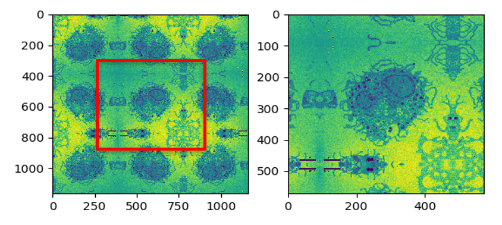
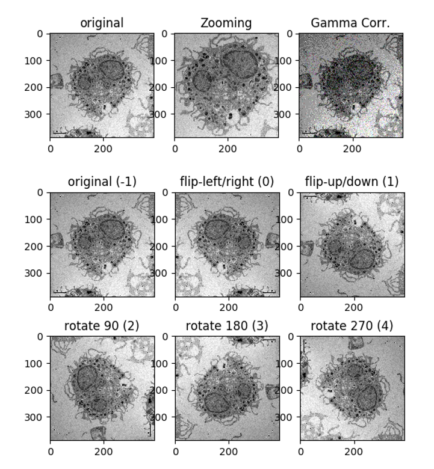
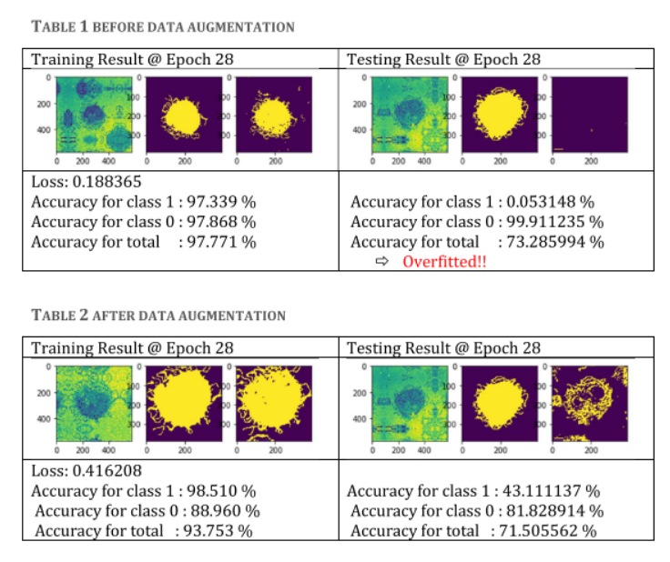
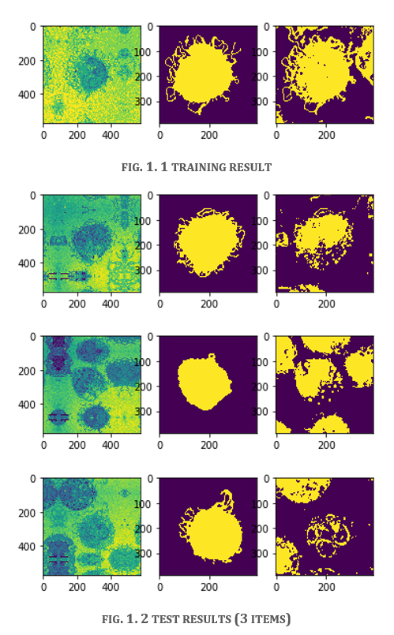

# Image-Segmentation-UNet
> Image Segmentation with Deep Neural Network (U-Net) 

<!--[![NPM Version][npm-image]][npm-url] -->
<!--[![Build Status][travis-image]][travis-url] -->
<!--[![Downloads Stats][npm-downloads]][npm-url] -->

This project is the part of the assignemnt in CMPT743 2019 

## Setup
```Matlab2018a```

## Input Data 
Rescaled the original data image from (1024, 1024) into (388, 388), and then applied mirroring to make (572, 572) 
-	Original Image Size: 1024 x 1024 
-	Data Image Size: 572 x 572 
-	Label Image Size: 388 x 388  


## Data Augmentation 
-	Random Zoom Images:  50% - 100% based on the center
-	Random Gamma Correction: gamma 0.5 - 1.5
-	Random Flip: Left-Right, Up-Down
-	Random Rotation: 0, 90, 180, 270



## Network Change 
The u-net model is customized as below. Based on my experiment, removing the ReLU at the last step and adding Batch normalization  seems working good for training stage, but initializing weights into normal distribution didn’t give any big differences. 

-	Delete the ReLU in the last step 
-	Add Batch Normalization every after ReLU
-	Add Normal Weight Initialization (Followed by the paper) 


# Results
-	Device: GPU
-	Epoch: 7 
-	Training Loss: 0.489522
-	Run time: 2 min 55 sec 

|--|Train (%)	|Test (%)|
|:--:|---:|---:|
|Accuracy for class 1 |	95.29	| 45.18|
|Accuracy for class 0 |	80.17	| 77.49|
|Accuracy for total	  | 85.10	| 68.88|



<!-- ## Usage example

A few motivating and useful examples of how your product can be used. Spice this up with code blocks and potentially more screenshots.

_For more examples and usage, please refer to the [Wiki][wiki]._
-->
## Author

Suhong Kim – [@github](https://github.com/suhongkim) – suhongkim11@gmail.com
<!--Distributed under the XYZ license. See ``LICENSE`` for more information.-->

## Inspiration
You can get more information on this assignment from 
[here](https://github.com/suhongkim/UNet-Image-Segmentation/blob/master/ref/Project%201%20-%20UNet.pdf)\n
Also, you can start from the original framework
[here](https://drive.google.com/file/d/15eX5Hs_2BiZWb8DuVCX7EqMROtirhsqW/view)

<!-- 
## Contributing

1. Fork it (<https://github.com/yourname/yourproject/fork>)
2. Create your feature branch (`git checkout -b feature/fooBar`)
3. Commit your changes (`git commit -am 'Add some fooBar'`)
4. Push to the branch (`git push origin feature/fooBar`)
5. Create a new Pull Request
-->
<!-- Markdown link & img dfn's -->
[npm-image]: https://img.shields.io/npm/v/datadog-metrics.svg?style=flat-square
[npm-url]: https://npmjs.org/package/datadog-metrics
[npm-downloads]: https://img.shields.io/npm/dm/datadog-metrics.svg?style=flat-square
[travis-image]: https://img.shields.io/travis/dbader/node-datadog-metrics/master.svg?style=flat-square
[travis-url]: https://travis-ci.org/dbader/node-datadog-metrics
[wiki]: https://github.com/yourname/yourproject/wiki
